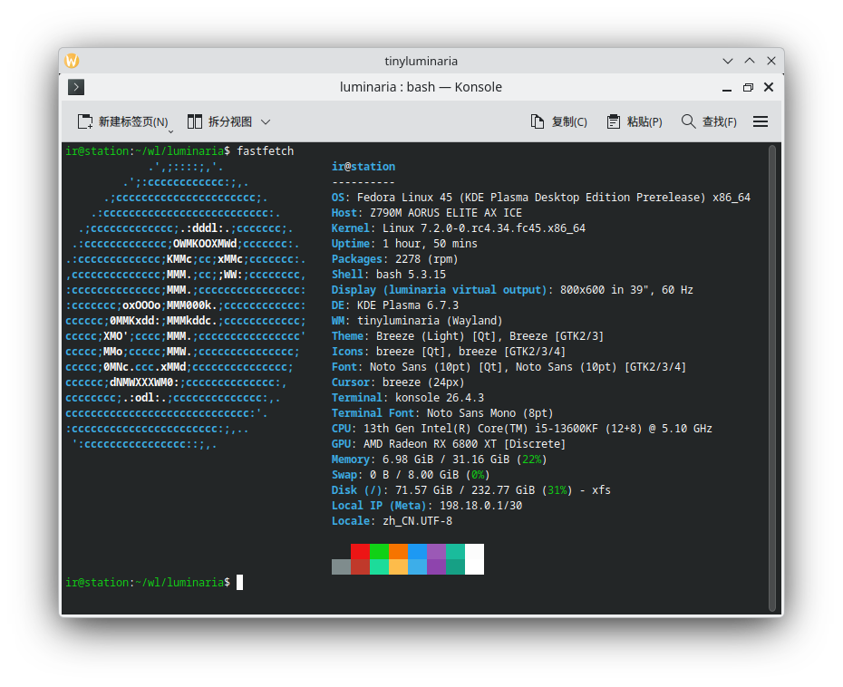

# Luminaria

从零实现的极简 Wayland compositor 库，现代 C++。
架在 `libwayland-server` 上（不重造线协议），Vulkan 渲染，Meson 构建。
设计原则：**对外友好、对内高效、整体简单**。

**当前状态：** P0 完成，**P1 除 IME 外全部完成**。真实客户端（`weston-terminal`）可连接、
映射窗口、GPU 合成，嵌套运行时可见且可交互。菜单/下拉框（`xdg_popup`，含
`constraint_adjustment` 贴边翻转）、subsurface、窗口状态、复制粘贴与拖放、触摸均已实现并有测试。

合成走**纯 GPU 链路**且**全程无 CPU 停等**：客户端 dmabuf 零拷贝导入成 Vulkan 纹理（按
`wl_buffer` 缓存），合成进一块导出为 dmabuf 的渲染目标，再由 **DRM atomic** 扫描输出。
显式同步链路是异步的 —— 客户端 acquire point 导出成 sync_file，作为 `VkSemaphore` 进入渲染
提交；渲染的 out-fence 作为 `IN_FENCE_FD` 交给 atomic commit；atomic 的 `OUT_FENCE_PTR` 回来
喂给下一帧。damage 走**多矩形 scissor**并按不透明区剔除遮挡。

裸机侧：**libseat 会话管理**（VT 切换安全）、**硬件光标平面**、**XCursor 主题加载**、
多输出热插拔、每输出 scale/transform。HiDPI 两侧齐全：整数 scale + `wp-viewporter` +
`wp-fractional-scale-v1` + 客户端 `set_buffer_scale`/`set_buffer_transform`。

---

## 依赖（Fedora）

核心：

```sh
sudo dnf install -y \
  gcc-c++ meson ninja-build pkgconf-pkg-config \
  wayland-devel wayland-protocols-devel \
  libxkbcommon-devel \
  vulkan-loader-devel vulkan-headers glslang mesa-vulkan-drivers \
  mesa-libgbm-devel libdrm-devel \
  libinput-devel libseat-devel systemd-devel
```

Xwayland（可选）：

```sh
sudo dnf install -y \
  xorg-x11-server-Xwayland libxcb-devel xcb-util-wm-devel
```

编译需 C++23 stdlib（`<expected>`），gcc ≥ 14 / clang ≥ 18，以及 Vulkan、xkbcommon、
libdrm、libinput、libudev、**libseat**、wayland-protocols，外加
**`glslangValidator`（glslang 包）**—— 渲染器的纹理四边形管线用它把 GLSL 编成 SPIR-V 并
直接嵌进二进制（运行时不读 shader 文件）。

光标主题不需要 libXcursor：XCursor 文件格式的解析器就在
`src/render/cursor_theme.cpp` 里（含主题继承与动画帧），免去把 X11 拖进 Wayland
compositor。

---

## 构建 & 测试

```sh
meson setup build
ninja -C build
meson test -C build
```

多数测试用**进程内 `libwayland-client`**（socketpair）驱动真实协议，无需 GPU /
父 compositor；Vulkan 测试用真 GPU；`wayland-nested` 连真父 compositor（有
`WAYLAND_DISPLAY` 才跑）。

---

## 已实现并测试

### 核心底层

| 模块 | 内容 | 测试 |
|---|---|---|
| core | `Result<T>` / `Error`、`CUnique` 句柄 RAII、`Signal<Event>` + RAII `Connection`（emit 期间 connect/disconnect 安全）、`Display`、`EventLoop` + `EventSource` | signal, core |
| util | `Box`、`Color`、`Pixel`、`Rect`（constexpr） | box |

### 协议对象（服务端）

| 模块 | 内容 | 测试 |
|---|---|---|
| 协议 | `wl_compositor` v6 + `wl_surface` — **全部请求实现，无空操作**：attach / commit / frame、damage + damage_buffer（按 buffer scale/transform 反算）、`set_opaque_region` / `set_input_region`（真 region，决定遮挡剔除与命中测试）、`set_buffer_scale` / `set_buffer_transform`、`offset`；`preferred_buffer_scale` / `preferred_buffer_transform` 事件。`frame` 回调**推迟到实际上屏**而非 commit | compositor, frame-timing, surface-state |
| 协议 | `wl_region` — `add` / `subtract` 由不相交矩形集实现（`util/region.hpp`），不是空操作 | region |
| 协议 | `wl_shm` buffer → RGBA 读回（ARGB8888 + XRGB8888） | client-texture |
| 协议 | `linux-dmabuf-unstable-v1` (v3) + GBM 分配器 — GPU 客户端 dmabuf buffer 导入（ARGB8888 / XRGB8888，**任意 GPU modifier**）；广告 GPU 实际支持的 modifier 列表。合成路径**零拷贝**：`Surface::current_buffer_texture()` 经 Vulkan external-memory 直接把客户端 dmabuf 变成 `GpuTexture`，不落 CPU（CPU RGBA 读回只留给 screencopy / 老式 shm buffer） | dmabuf, gpu-scanout |
| 协议 | `xdg_wm_base` v5 / `xdg_surface` / `xdg_toplevel` 全生命周期（配置握手 → map/unmap）；窗口状态机：maximize / fullscreen / activated / resizing 随 configure 下发，title / app_id / min-max size / window geometry 全部记录，交互式 move/resize 与 minimize 以信号交给 compositor 仲裁；`configure_bounds`（v4）+ `wm_capabilities`（v5） | xdg, toplevel-state |
| 协议 | `xdg_popup` + `xdg_positioner` v3 — 菜单 / tooltip / 下拉框：anchor / gravity / offset 完整求解，**`constraint_adjustment` 真正施加**（flip → slide → resize，逐轴独立；父窗口位置由 `XdgShell::set_popup_constraint_query()` 提供），`grab`、`reposition` + `repositioned`、父级销毁时级联 `popup_done` | popup |
| 协议 | `zxdg_decoration_manager_v1` — 谁画标题栏。客户端问、compositor 答，答案有约束力。库不画装饰，所以默认答 client-side（无框窗口比双标题栏更糟） | scaling |
| 协议 | `wp_viewporter` — 裁剪 + 拉伸一块 buffer。视频播放器免重编码加黑边；小数缩放的客户端用它声明"我这块整数 buffer 代表多大的逻辑尺寸" | scaling |
| 协议 | `wp_fractional_scale_v1` — 输出的真实缩放，以 120 分之一为单位（180 = 1.5x）。`wl_output.scale` 是整数，说不出 150% | scaling |
| 协议 | `wl_subcompositor` / `wl_subsurface` — 子表面树、相对定位、`place_above`/`place_below` 堆叠、**sync/desync 语义**（同步子表面的 commit 缓存到父级 commit 时原子提交）；`Surface::surface_tree()` / `surface_at()` 供渲染与命中测试共用 | subsurface |
| 协议 | `wl_seat` v5 — 键盘（xkb keymap）+ 指针 + 触摸，焦点 enter/leave + 事件路由；滚轮（平滑 axis / 离散 notch / axis_stop）、`set_cursor`（发信号给 compositor 合成光标）；**焦点安全**：seat 订阅 `Surface::destroy`，被销毁的聚焦表面自动清空，无悬空指针 | seat, seat-input |
| 协议 | `wl_data_device_manager` v3 — 剪贴板（选区随键盘焦点转移）+ 拖放（drag 期间 seat 把指针交给 data device，enter/motion/drop 全流程，dnd actions）；数据经管道在客户端之间直传，compositor 不读内容 | data-device, dnd |
| 协议 | `zwp_primary_selection_device_manager_v1` — X11 式中键粘贴选区 | data-device |
| 协议 | `wp_single_pixel_buffer_v1` — 1×1 纯色 `wl_buffer`，无 shm pool、无 GPU 分配。客户端画背景/压暗层/黑边不必再为一块纯色开整屏 buffer | single-pixel |
| 协议 | `wp_presentation`（presentation-time v2）— 帧真正上屏的时刻 + 刷新周期，时间戳直接来自 KMS 的 vblank（CLOCK_MONOTONIC，`hw_clock` 标志）。动画不再靠猜时间 | frame-timing |
| 协议 | `wp_tearing_control_v1` — 客户端（游戏）请求不等 vblank 直接上屏；hint 是双缓冲 surface 状态，DRM 后端转成 `DRM_MODE_PAGE_FLIP_ASYNC` | tearing |
| 协议 | `wp_cursor_shape_v1` (v2) — 客户端说要哪种光标（`text` / `ns-resize` / …）而非自带位图；36 种 shape 全部映射到 XDG 光标名，交给 compositor 画 | cursor-shape |
| 协议 | `ext_workspace_v1` — 工作区列表 / 切换（面板、pager）。服务端拥有工作区集合，客户端只能请求；group ↔ output 关联、state（active/urgent/hidden）、请求经 `commit` 批量下发 | workspace |
| 协议 | `linux-drm-syncobj-v1` — 显式 GPU 同步，**全异步、无 CPU 等待**：acquire point 导出成 sync_file 交给渲染器当 `VkSemaphore` 等；渲染的 out-fence 直接写进客户端的 release point，客户端在 GPU 停止读取的那一刻就能复用 buffer | syncobj |
| 协议 | `wl_output` v4 — geometry / mode / scale / name / description / done（客户端 map 前需要；`name` 是 `grim -o` 等工具寻址输出用的）。`set_scale()` / `set_transform()` 会重发几何信息并以 `done` 收尾 | output-scale |
| 协议 | `xdg-output-unstable-v1`（`zxdg_output_manager_v1` v3）— 输出的**逻辑**位置与尺寸（mode ÷ scale，旋转时长宽互换），随 scale/transform/位置变化实时更新。wl_output 只描述物理模式；要把截图摆到画布上的工具（grim / slurp / 录屏器）读的是这个。缺了它 `grim` 只会警告并写出 0×0 的 PNG | — |
| 协议 | 截图/录屏 — `wlr-screencopy-unstable-v1` (v3) + `ext-image-copy-capture-v1` + `ext-image-capture-source-v1`：客户端捕获整块输出到 **wl_shm 或 dmabuf** buffer（`grim` 截图、`wf-recorder` 录屏），逐帧回调 GPU 合成结果；dmabuf 目标 LINEAR 走 mmap，tiled 走 Vulkan 导出，ext 路径广告 dmabuf device + modifier | dmabuf |

### 渲染

| 模块 | 内容 | 测试 |
|---|---|---|
| render | Vulkan-Hpp RAII：纯色背景、矩形填充、客户端纹理合成（真 GPU 读回验证） | vulkan, composite, texture |
| render | 纹理裁剪 — 部分越界的 surface 只渲染可见部分（之前跨输出边缘直接丢弃） | texture |
| render | **GPU 合成链**：`GpuTexture`（客户端 dmabuf 零拷贝导入 / shm 上传一次）→ `render_to()` 直接合成进 `ScanoutTarget` —— 一块用 `VK_EXT_image_drm_format_modifier` 分配、再导出成 dmabuf 的 Vulkan 渲染目标。整条链没有一次 CPU 读回 | gpu-scanout |
| present | `Output::import_scanout(dmabuf)` / `commit_scanout(id, in_fence)` —— 渲染目标即 KMS framebuffer（`drmModeAddFB2WithModifiers`），双缓冲 atomic 翻页；渲染 out-fence 作为 `IN_FENCE_FD` 交给显示硬件，`OUT_FENCE_PTR` 经 `take_present_fence()` 反向喂回下一帧 | gpu-scanout |
| present | `Output::set_cursor/move_cursor/hide_cursor` —— **硬件光标平面**：移动指针是一次只碰 cursor plane 的小 atomic 提交，不重绘任何东西 | drm（需 tty） |
| present | `Output::present` 信号 —— 帧上屏时刻（DRM 给真 vblank 时间戳 + 序号，其余后端给 CLOCK_MONOTONIC）。`wl_surface.frame` 与 `wp_presentation` 都由它驱动 | frame-timing |
| render | **damage 渲染**：`render_to(..., damage)` 把脏区折成不相交 `Region`，**逐矩形 `setScissor`** 各画一次 —— 两块分散的小脏区就是两个小 scissor，不是横跨它们的大矩形。未触及的像素原样保留；双缓冲下调用方需并上上一帧的 damage（buffer age） | frame-timing, gpu-scanout |
| render | **遮挡剔除**：`GpuTextureFill::opaque` 声明的不透明区从前往后累积，被完全盖住的表面一次都不采样 —— 最大化窗口下的壁纸不进 GPU | gpu-scanout |
| render | **异步提交**：`RenderSync` 让 `render_to` 等一组 sync_file（客户端 acquire point）并吐出 out-fence，自己不阻塞；未完成的提交挂在 in-flight 列表上按 fence 回收 | gpu-scanout |
| render | **纹理缓存**：`Surface::buffer_texture()` 按 `wl_buffer` 缓存。dmabuf 导入是客户端内存的实时视图，跨帧保留；shm 上传是快照，客户端重绘时才重传 | — |
| render | **光标主题**：自带 XCursor 解析器（`cursor_theme.cpp`），读 `/usr/share/icons/<主题>/cursors`，支持主题继承与动画帧。不依赖 libXcursor / X11 | cursor-theme |
| render | **纹理四边形管线**（取代原先的 blit）：每个 surface 一次 draw，位置/UV 全走 push constant。由此一并拿到 **整数 scale**、**8 种 transform 全部（含 90/270 转置）**、以及**真正的 alpha 混合**（预乘 `ONE`/`ONE_MINUS_SRC_ALPHA`）。SPIR-V 由 `glslangValidator --vn` 编进二进制 | gpu-scanout |
| present | `Output::commit_frame(pixels)` 呈现渲染帧（headless 存帧，DRM 写 dumb buffer）—— 保留给无 dmabuf 的降级路径 | render-output |
| render | `read_scanout()` —— 需要 CPU 像素时（嵌套 wl_shm 呈现、screencopy）从渲染目标**自己的 VkImage** 拷出，暂存 buffer 建一次并常驻映射，优先要 HOST_CACHED 内存。之前每帧重新 import 一遍自己的 dmabuf 再从非缓存内存逐像素读，800×600 要 90ms —— 指针拖动卡顿就是它 | gpu-scanout |

### 后端

| 模块 | 内容 | 测试 |
|---|---|---|
| backend | 抽象 `Backend` + `HeadlessBackend`（软件帧泵，无 GPU/显示） | headless |
| backend | `WaylandBackend`（嵌套）：连父 compositor 开窗、wl_shm 呈现合成帧；**转发父 compositor 输入**（指针 enter/leave/motion/button、滚轮 axis/discrete/stop 按 `wl_pointer.frame` 聚合、键盘按键 + 修饰键），经命中测试路由到 seat；**原生窗口装饰**：以 `xdg-decoration-unstable-v1` 客户端身份向父 compositor 请求 server-side 装饰（附 title + app_id），拿到宿主桌面的真标题栏，协商结果由 `decoration_mode()` 报告 | wayland-nested |
| backend | `DrmBackend`（裸机 KMS）：**多输出 + 热插拔** —— 每个已连接 connector 各分一套 CRTC + primary plane，各自 modeset/翻页；udev netlink 监听 `drm` 子系统的 `HOTPLUG=1` 事件后重扫 connector 并做差集，新显示器发 `new_output`、拔掉的发 `Output::destroy`（并还原它自己的 CRTC）；**atomic 模式设置**（connector CRTC_ID + CRTC MODE_ID/ACTIVE + primary plane 全套 property，一次 `drmModeAtomicCommit`）、非阻塞翻页 + `page_flip_handler2` vblank 帧泵；scanout buffer 走 dmabuf 导入（`IN_FORMATS` 交出硬件真实支持的 modifier 列表），dumb buffer 仅作降级路径（真机未验证，测试 skip） | drm（需 tty） |
| backend | `LibinputBackend`（裸机输入）：发出 KeyEvent / PointerMotion / PointerButton 信号；给了 `Session` 就经 libseat 开设备，VT 切换时 `libinput_suspend/resume` | libinput |
| session | `Session`（libseat）—— 谁现在有权碰 GPU 和输入设备。VT 切走时 DRM 后端 `drmDropMaster` 并停止提交，切回时重取 master + 重新 modeset。没有它也能从已登录 VT 跑，只是切 VT 不安全 | session（需 seat） |

### 布局

| 模块 | 内容 | 测试 |
|---|---|---|
| layout | `OutputLayout` —— 输出在全局坐标系里的位置：`add_auto()` 横向排列、`box_of()` / `bounds()` / `at(x,y)` 命中、`intersecting(box)` 求窗口跨屏时各屏该画哪一块。用的是**逻辑尺寸**，所以旋转/HiDPI 输出占的格子跟它的 mode 不一样 | output-layout |
| layout | `Transform` + `Output::scale()` —— 每输出旋转/翻转（值与 `WL_OUTPUT_TRANSFORM_*` 一致）与整数缩放。`transform_box()` 是逻辑坐标 → 帧缓冲像素的唯一映射，`transform_invert()` 供输入反向映射 | output-layout, output-scale |

### 场景 / Xwayland / 示例

| 模块 | 内容 | 测试 |
|---|---|---|
| scene | 场景树 + 定位 + 命中测试 + 扁平化到渲染器 | scene |
| xwayland | 启动 Xwayland + 最小 XWM（xcb 连接、重定向 root、map/configure） | xwayland |
| example | `tinyluminaria`（嵌套/headless 参考 compositor）、`luminaria-drm-demo`、`luminaria-tty`（裸机 compositor） | tinyluminaria-smoke |
| 生命周期 | 关闭的窗口在下帧回收，无残留条目 | — |

---

## 运行

**嵌套**（在现有桌面里开一个窗口，暴露自己的 `WAYLAND_DISPLAY` 供客户端连接）：

```sh
WAYLAND_DISPLAY=wayland-0 ./build/examples/tinyluminaria &
WAYLAND_DISPLAY=<打印的 socket 路径> weston-terminal
# 或 LUMINARIA_BACKEND=headless 强制无头模式；LUMINARIA_OUTPUT=1280x800 改输出尺寸
```

**裸机**（需切到空闲 VT、停掉桌面，对该 VT 有 DRM master + 输入 ACL）：

```sh
./build/examples/luminaria-tty                 # 自动探测 /dev/dri/card*，可传 card1 显式指定
```

`luminaria-tty` 是完整裸机 compositor：DRM 输出 + libinput 输入 + wl_compositor /
xdg-shell / seat，每帧用 Vulkan 合成 mapped 客户端窗口后扫描到显示器，键盘路由到
聚焦窗口，Esc 退出。它打印自己的 `WAYLAND_DISPLAY`，从另一 VT / ssh 指客户端过来：

```sh
WAYLAND_DISPLAY=wayland-1 weston-terminal
```

**截图 / 录屏**（compositor 跑起来后，任一后端，指向它的 `WAYLAND_DISPLAY`）：

```sh
sudo dnf install -y grim wf-recorder            # 依赖 screencopy 协议的现成客户端
WAYLAND_DISPLAY=<socket> grim shot.png          # 整屏截图 → PNG
WAYLAND_DISPLAY=<socket> wf-recorder -f out.mp4 # 录屏（Ctrl-C 停）
```

`grim` 走 `wlr-screencopy-unstable-v1`，把当前帧的 GPU 合成结果拷进它自己的 shm
buffer；`wf-recorder` 逐帧拉流。示例 compositor 已注册截图 manager 并挂好每个
输出的 capture 回调。

---

## 完整 Compositor 路线图（缺失协议 / 部分）

达到"能日常用的完整 Wayland compositor"还需实现以下内容。按**客户端是否可用**分层。
✓=已有，✗=缺，△=部分。参照：wlroots 有 73 个 type 实现，luminaria 现有 13 个。

### P0 — 不做真实程序直接跑不起来 ✅ 全部完成

- ✓ **`linux-dmabuf-v1` (v3) + GBM 分配器** — GPU 客户端（浏览器 / GL·Vulkan app /
      游戏 / 视频）走 dmabuf 而非 wl_shm。GBM 开 render node 做分配器/校验；向客户端广告
      GPU 实际支持的 modifier 列表（经 Vulkan `VK_EXT_image_drm_format_modifier` 查询）。
      导入：走 Vulkan external-memory (`VK_EXT_external_memory_dma_buf` +
      `VK_KHR_external_memory_fd`) 直接变成 GPU 纹理，合成结果写进一块导出成 dmabuf 的
      渲染目标，由 KMS 直接扫描输出 —— 全程不经 CPU。
      **仍待做：** 直接把**客户端** buffer 当 scanout plane 提交（全屏单窗口免合成），
      以及硬件光标 plane —— 都是 atomic 之上的正交优化。
- ✓ **explicit sync**（`linux-drm-syncobj-v1`）— `import_timeline` 把客户端 DRM timeline
      syncobj 导进 render node；commit 时按 acquire point 做**有界** `drmSyncobjTimelineWait`
      （默认 50 ms，可调；超时只丢一帧，不卡死事件循环），buffer 被下一次 commit 替换时
      `drmSyncobjTimelineSignal` release point —— 即原本发 `wl_buffer.release` 的时刻。
- ✓ **`xdg_popup` + `xdg_positioner`** — 菜单 / tooltip / 下拉框 / 右键菜单。positioner v3
      全部请求实现，anchor / gravity / offset 求解出 popup 矩形；`grab` 语义（点击外部
      dismiss，子 popup 先于父 popup 关闭）、`reposition` + `repositioned`、父 xdg_surface
      销毁时级联 `popup_done`。**注：** `constraint_adjustment`（flip/slide/resize）已解析
      但未施加 —— 需要父窗口在输出上的绝对位置，shell 层拿不到；屏幕内的菜单（常态）位置正确，
      贴边的可能溢出。
- ✓ **xdg-shell 窗口状态**：maximize / fullscreen / activated / resizing 随 configure 的
      states 数组下发；`configure_bounds`（v4）、`wm_capabilities`（v5）；min/max size、
      title、app_id、window geometry 全部记录；interactive move/resize、minimize 以信号交给
      compositor 仲裁（无人接管时自动应答，客户端不会挂住）。
- ✓ **`wl_subcompositor`**（subsurface）— 子表面树 + 相对定位 + `place_above`/`place_below`
      堆叠 + **sync/desync**：同步子表面的 commit 缓存下来，父级 commit 时整棵子树原子提交。
      `Surface::surface_tree()` 给渲染和命中测试同一份 z 序列表。
- ✓ **`wl_data_device`** — 复制粘贴 + 拖放。选区跟随键盘焦点；`receive` 把客户端给的管道 fd
      直接转交源客户端，字节不经过 compositor。拖放期间 seat 把指针从 `wl_pointer` 切到
      `wl_data_device`（enter/motion/drop），支持 dnd actions 协商与 `finish`。
- ✓ **primary-selection**（中键粘贴）— `zwp_primary_selection_device_manager_v1`，同样跟随焦点。
- ✓ `wl_seat`：键盘 + 指针 + **触摸**（down/motion/up/frame/cancel）+ **滚轮**
      （平滑 axis、离散 notch + `axis_discrete`、`axis_source`、`axis_stop`）。嵌套后端按
      `wl_pointer.frame` 聚合父 compositor 的滚动事件后转发。
- ✓ **光标渲染** — `wl_pointer.set_cursor` 记录客户端光标 surface + hotspot 并发
      `cursor_changed` 信号；`tinyluminaria` 把它合成在最上层，客户端没设光标时画内置箭头。
      指针焦点离开或光标 surface 销毁时自动清除。
- ✓ **seat 焦点安全** — 键盘/指针/触摸焦点与光标 surface 各自订阅 `Surface::destroy`
      （RAII `Signal::Connection`），表面销毁即清空焦点并发出焦点变更信号，不再有裸指针悬空。

### P1 — 真实桌面必须 ✅ 除 IME 外全部完成

- ✓ **多输出 + 热插拔 + output layout + 每输出 scale/transform** — DRM 后端枚举全部已连接
      connector 并用 udev 跟踪插拔，每屏独立 CRTC/plane/scanout buffer/damage；`OutputLayout`
      提供全局坐标系与跨屏裁剪；`Output::set_scale()` / `set_transform()` 贯穿协议（wl_output +
      xdg-output）、布局与渲染（纹理四边形管线做真旋转）。**仍缺**：小数缩放（见 HiDPI 条）、
      模式切换（当前固定用 connector 的首选模式）
- ✓ **`xdg-decoration`** — **两侧都做了**。客户端一侧：嵌套后端向父 compositor 请求
      server-side 装饰，我们的窗口在宿主桌面上有原生标题栏
      （`WaylandBackend::decoration_mode()` 报告协商结果）。服务端一侧：
      `zxdg_decoration_manager_v1` global，客户端问、compositor 通过
      `XdgDecorationManager::request()` 答。**默认答 client-side** —— 本库不画装饰，
      承诺 server-side 只会得到一个没有标题栏的窗口。
- ✓ **`presentation-time`** — `wp_presentation` global 已实现；`Output::present` 由 KMS page-flip
      的真实 vblank 时间戳驱动，`wl_surface.frame` 也一并挪到上屏时刻（**注意**：compositor 现在
      必须自己调 `Surface::send_frame_done()`，否则客户端会一直等）
- ✓ **damage tracking** — `wl_surface.damage` / `damage_buffer` 累积到 `Surface::damage()`
      （damage_buffer 按 buffer scale/transform 反算回 surface 坐标）；GPU 路径把脏区折成
      **不相交 `Region`，逐矩形 scissor** 各画一次；`set_opaque_region` 声明的不透明区从前往后
      累积，**被完全遮挡的表面一次都不采样**。scene 层也消费 damage
      （`scene_damage()` / `scene_rects(root, damage)` / `scene_textures()`）
- ✓ **HiDPI** — 整数 scale（`wl_output.scale` + 渲染器缩放）、`wp-fractional-scale-v1`
      （真实缩放，120 分之一为单位）、`wp-viewporter`（源裁剪 + 目标拉伸）、客户端侧
      `set_buffer_scale` / `set_buffer_transform`（buffer transform 与输出 transform 复合成
      一次采样），以及 `wl_surface.preferred_buffer_scale`（v6）
- ✗ **IME**：`text-input-v3` + `input-method-v2` — 中文/日文输入法（**P1 唯一未做项**）
- ✓ **libseat** 会话管理 + VT 切换 —— `luminaria/session.hpp`。设备经 libseat 打开；
      会话失活时 DRM 丢 master、停止提交、libinput 挂起，恢复时重取 master 并重新 modeset。
      没有 seat 时如实降级（仍可从已登录 VT 跑，只是切 VT 不安全）
- ✓ **光标** — `cursor-shape-v1`（shape → XDG 光标名）、**光标主题加载**
      （`luminaria/cursor_theme.hpp`，自带 XCursor 解析器，支持主题继承与动画帧，不依赖
      libXcursor）、**硬件光标 plane**（移动指针是一次只碰 cursor plane 的 atomic 提交）
- ✓ **libinput 路由到 seat** — `luminaria-tty` 用与渲染同一份图层列表做命中测试
      （`Surface::accepts_input()`，尊重 input region），指针 enter/motion/button 与
      点击提焦全部接线。
- ✓ **键图一致性** — 嵌套后端保留父 compositor 的 keymap 并经 `keymap_changed` 发出；
      `Seat::set_keymap()` 采用它并重发给所有客户端。修饰键掩码与 keymap 从此同源。

### P2 — 完整功能 / 桌面外壳

- ✗ **layer-shell**（`wlr-layer-shell` 或 `ext-*`）— 面板 / 状态栏 / 壁纸 / 锁屏层
- ✗ **`ext-session-lock-v1`** — 锁屏
- ✓ **截图/录屏**：`wlr-screencopy-unstable-v1` (v3) + `ext-image-copy-capture-v1` + `ext-image-capture-source-v1` — 客户端捕获整块输出到 **wl_shm 或 dmabuf** buffer。三个 global 一起注册，每个可捕获输出经 `add_output()` 挂上 capture 回调，客户端请求时回调填 RGBA（当前帧 GPU 合成结果）。dmabuf 目标：`set_renderer()` 后 wlr 路径发 `linux_dmabuf` 事件、ext 路径广告 `dmabuf_device` + 每格式 modifier；写入时 LINEAR 走 mmap，tiled 走 `VulkanRenderer::export_dmabuf`。`grim` 截图、`wf-recorder` 录屏皆可。
- ✓ **`ext-workspace-v1`** — 工作区列表/切换（见协议表）
- ✗ **`wlr-foreign-toplevel-management`** — 任务栏列窗口
- ✗ **`xdg-activation`** — 焦点转移 / 紧急提示
- ✗ **idle**：`ext-idle-notify` + idle-inhibit（视频防息屏）
- ✗ **output-management + gamma-control**（夜间模式）
- ✗ **data-control**（剪贴板管理器）
- ✗ **relative-pointer + pointer-constraints**（游戏/3D 锁定光标）、tablet-v2、pointer-gestures

### 非协议部分

- △ **真正的 XWM**（现 xwayland 极简）— 窗口堆叠、焦点、`_NET_*` hints、ICCCM/EWMH、override-redirect、X 剪贴板桥、`WL_SURFACE_ID` 关联
- ✓ **DRM atomic 模式设置 + GPU scanout** —— legacy pageflip 已整体弃用；**硬件光标 plane 已做**。
      剩下的是客户端 buffer 直出 primary plane（全屏免合成）与多输出同帧提交
- ✓ **异步 explicit sync 链路** —— acquire fence → `VkSemaphore` → 渲染 out-fence →
      atomic `IN_FENCE_FD`；`OUT_FENCE_PTR` 反向喂回。整条链路没有一次 CPU 停等
- △ **渲染管线**：✓ 多矩形 scissor damage、✓ 不透明遮挡剔除、✓ alpha 混合、✓ 缩放与旋转、
      ✓ buffer transform 与输出 transform 复合、✓ viewporter 裁剪；仍缺圆角/阴影等效果、离屏缓冲

### 建议实现顺序（最短能用路径）

1. ~~**dmabuf import + GBM 分配器 + 零拷贝 GPU 合成/scanout**~~ — ✓ 已做（任意 modifier，dmabuf → Vulkan 纹理 → 合成进导出的 scanout dmabuf → DRM atomic 提交）
2. ~~**xdg_popup + 窗口状态**~~ — ✓ 已做，解锁绝大多数 GTK/Qt app
3. ~~**data_device（剪贴板）**~~ — ✓ 已做；**xdg-decoration** 仍缺（见 P1）
4. ~~**多输出 + damage + presentation-time**~~ — ✓ 已做
5. ~~**热插拔（udev）+ 每输出 scale/transform**~~ — ✓ 已做
6. ~~**异步 explicit sync + 多矩形 damage + libseat + 光标平面/主题 + HiDPI 全套**~~ — ✓ 已做
7. **layer-shell + session-lock** — 有这个才算"桌面"
8. **text-input / input-method** — 中文输入（P1 最后一项）

---

## 已知限制

- **无独立于 Shift/Ctrl 的修饰键状态**（除父 compositor 报告的之外，嵌套模式）— 实践中够用。
- **嵌套窗口装饰取决于父 compositor**：KDE/Plasma、wlroots 系给 server-side（有原生标题栏）；
  GNOME/Mutter 不实现 `xdg-decoration`，窗口裸奔。我们**不画** client-side 装饰 ——
  「原生装饰」按定义就是宿主画的，自绘一套是另一回事。
- **popup 的 `constraint_adjustment` 需要 compositor 配合**：必须调
  `XdgShell::set_popup_constraint_query()` 告诉 shell 父窗口在哪，否则贴边菜单仍会溢出
  —— shell 层无从知道窗口摆在哪个位置。`tinyluminaria` 已接线。
- **DRM 路径在当前环境未在真机上验证**（无裸 VT）—— 含 atomic 提交、`IN_FENCE_FD` /
  `OUT_FENCE_PTR`、多输出分配、udev 热插拔、硬件光标平面与 VT 切换。渲染与几何这一侧有测试
  覆盖（`output-layout` / `output-scale` / `gpu-scanout` / `region` / `cursor-theme`），
  但"真实显示器上的翻页"只能在真机上确认。`session` 测试在没有 seat 的环境里 skip。
- **热插拔只覆盖 connector 状态**：GPU 本身热插拔（拔掉整块显卡 / DRM 设备消失）不处理。
  也不做模式切换 —— 每个输出固定用 connector 报的首选模式。
- **嵌套/headless 后端每帧有一次全屏 CPU 读回**（`read_scanout`，800×600 约 2.6ms release /
  13ms debug）。这是 wl_shm 呈现的代价，DRM 后端没有 —— 它直接扫描输出 dmabuf。
- **默认 `meson setup build` 是 debug（`-O0`）**，逐像素转换会慢 5 倍。跑真实负载用
  `meson setup --buildtype=release build-rel`。
- **渲染器必须比 Display 活得久**：Surface 缓存的 `GpuTexture` 属于 `VulkanRenderer`。
  两个示例都把渲染器声明在 Display 之前（局部变量逆序析构）。
- **`send_frame_done()` 是 compositor 的责任**：`wl_surface.frame` 不再在 commit 时自动应答，
  基于本库的 compositor 必须在帧上屏时调用它（示例见 `tinyluminaria` / `luminaria-tty`）。
- **异步同步链路需要 GPU 支持 `VK_KHR_external_semaphore_fd`**。没有它时
  `render_to()` 退回 fence 阻塞，功能不变、延迟变差；同理驱动缺 `IN_FENCE_FD` /
  `OUT_FENCE_PTR` 属性时那两段自动跳过。
- **`Region` 不合并相邻矩形**（O(n) 矩形向量）。真实负载让矩形数量成为问题时换
  `pixman_region32`；已在源码里标了 `ponytail:`。
- 抽象 `Backend`/`Output` 已就位，以上待实现项按同一模式扩展即可接入。

---

## 说明

用 `-std=c++23` 构建（依赖的最新特性是 `std::expected`，其余是 C++20/17）。内存安全
由构造保证：每个 C 句柄都 RAII 包装，每个信号监听析构自动摘链，无需手动 `wl_list_remove`。

---

## 截图



`tinyluminaria`（本库自带的参考 compositor）**嵌套**跑在 KDE Plasma 里 —— 最外层那条标题栏是
宿主画的**原生装饰**（经 `xdg-decoration-unstable-v1` 向父 compositor 请求 server-side）。
框内是我们自己合成的 800×600 输出，里面跑着 konsole，konsole 里跑 fastfetch。
注意 fastfetch 自己认出了 `WM: tinyluminaria (Wayland)` 与 `Display (luminaria virtual output)`。

复现：

```sh
WAYLAND_DISPLAY=wayland-0 ./build/examples/tinyluminaria &     # 嵌套；打印自己的 socket
WAYLAND_DISPLAY=<打印的 socket> konsole --nofork               # 然后在里面敲 fastfetch
```
